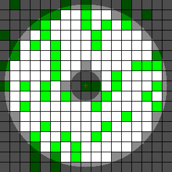

# Slimefinder tool

Slime finder is a command line tool to search for locations in a Minecraft world with specific amounts of slime chunks within certain range of a player. It was designed to look for mobfarm perimeter locations where the number of slime chunks in the perimeter is either very high or very low.

## Release
[slimefinder-1.3.2.jar](https://github.com/Nukelawe/slimefinder/releases/download/1.3.2/slimefinder-1.3.2.jar)\
[slimefinder-1.3.1.jar](https://github.com/Nukelawe/slimefinder/releases/download/1.3.1/slimefinder-1.3.1.jar)\
[slimefinder-1.3.jar](https://github.com/Nukelawe/slimefinder/releases/download/1.3/slimefinder-1.3.jar)

## Usage
Run the jar file with the command
```
java -jar slimefinder-<version>.jar <command-line-options>
```
When running in for the first time, the slimefinder will generate the default property files and exit. Edit the property files for your needs and re-run using the same command. To understand what all the properties mean and how to use them please refer to the [user manual](Slimefinder/documentation/user-manual.md).

## Commands 

### Building

The project can be run in development mode with the command

```
mvn exec:java -Dexec.mainClass="slimefinder.core.Slimefinder" -Dexec.args="command line arguments"
```

The jar-file can be built with the command

```
mvn package
```

### Testing

Tests are run with the command

```
mvn test
```
