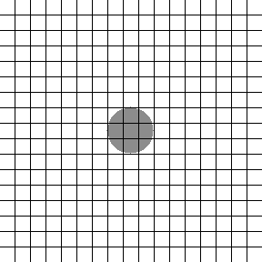
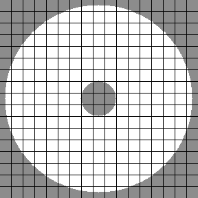

# Slimefinder

Slime finder is a command line Java tool to search for locations in a Minecraft world with specific amounts of slime chunks within certain range of a player. It was designed to look for mobfarm perimeter locations where the number of slime chunks in the perimeter is either very high or very low.

It can be run with the command:
```
java -jar slimefinder.jar <command-line-options>
```  
in the directory where ``slimefinder.jar`` is located.

The program has two possible modes, search and image generation. They are both specified by giving command line arguments. The available options are the following:

``-h``  
Shows the available options and their descriptions.``

``-s``  
Enters the search mode.

``-i``  
Enters the image generation mode.

If both ``-s`` and ``-i`` are given the search will be performed first and the image generation immediately afterwards. The settings for the slime finder are given in three separate property files. The files ``search.properties`` and ``image.properties`` contain settings for the search- and image generation modes, respectively and the file ``mask.properties`` contains general information that is needed in both modes. If a required property file does not exist a new one with default properties will be created. Any missing properties will be added and initialized with defaults and extra properties will be ignored and removed.

## Mask properties

The file ``mask.properties`` defines the parameters necessary in both the image generation and search modes. It has
the following fields:

| property | type | default value |
|:--- |:--- |:---|
| world-seed     | long | ``0`` |
| despawn-sphere | boolean  | ``true`` |
| exclusion sphere | boolean | ``true`` |
| y-offset | integer | ``0`` |
| chunk-weight | integer | ``0`` |

**Block mask** at position P is the set of block positions with a particular y-coordinate in which a hostile mob could spawn if a player was positioned at P. Here we restrict ourselves to inspect a single y-coordinate because slime spawning depends heavily on
altitude.

The shape of the block mask is determined by the **y-offset** with respect to the player as well as the mask components listed below. 

**Despawn sphere** is a sphere of radius 128 blocks centered around a player outside which a slime would instantly despawn.

**Exclusion sphere** is a sphere of radius 24 centered around a player inside which mobs cannot spawn.

Each of the mask components can be individually disabled in the ``mask.properties``-file by setting them to false. How the block mask is calculated from the mask components is illustrated below.

Shape of the mask with only despawn sphere enabled  


Shape of the mask with only exclusion sphere enabled  


Shape of the mask with both the despawn and exclusion spheres enabled  


**Chunk mask** at position P is the set of chunks for which the number of blocks inside the corresponding block mask is greater than the chunk-weight. How the chunk mask depends on the min-chunk-weight is illustrated below.

`chunk-weight = 0`. At least one block in each chunk is contained by the block mask.


`chunk-weight = 255`. Chunks are completely contained by the block mask.


## Search properties

The file ``search.properties`` defines the parameters necessary for the search mode. It has the following fields:

| property | type | default value |
|:--- |:--- |:---|
| output-file | string | ``results.dat`` |
| start-pos | coordinate | ``0,0`` |
| fine-search | boolean | ``false`` |
| append | booean | ``false`` |
| min-width | integer | ``0`` |
| max-width | integer | ``1`` |
| min-block-size | integer | ``0`` |
| max-block-size | integer | ``73984`` |
| min-chunk-size | integer | ``0`` |
| max-chunk-size | integer | ``289`` |

**Block size** and **chunk size** are the areas of slime chunks within the block mask and the chunk mask, respectively. Block size is represented in blocks and the unit of area is therefore 256 times smaller.

In the search mode the slime finder looks for positions for which block size and chunk size are within a range specified by the properties **min-block-size** and **max-block-size** for the block size or **min-chunk-size** and **max-chunk-size** for the chunk size. 

A starting position for the search is given by specifying a position in the **start-pos**-field. The position can be given in either block or chunk format.  
In block format the coordinates are given in the format ``x,z``,  
where ``x`` and ``z`` are the block coordinates.  
In chunk format the coordinates are given in the format ``xc:xi,zc:zi``,  
where ``xc`` and ``zc`` are the chunk coordinates and ``xi`` and ``zi`` are the block coordinates within the chunk.

The search will check all chunk positions in the square of width **max-width** centered around the starting chunk. Positions in the square of width **min-width** centered around the starting chunk will be skipped. The positions will be iterated through in a spiralling manner which ensures that matches are listed from closest to farthest from starting position.

If **fine-search** option is set to ``true`` all block positions in each chunk are checked. Otherwise only one position within each chunk is checked. 

The matching positions found are written on a file specified by the **output-file**-field. If the file does not exist a new one with the given name will be created if possible. Unless **append** is set to true an existing output file will be overwritten without a warning! The output-file can also contain a path to a directory.

Every line in the output file containing no data should either start with a # or consist of whitespace only. This is important for the file to be readable when used as an input for the image generation mode.

Each line in the output file describes a single position. The lines of data are formatted as follows:
 
```<xBlock>,<zBlock> <xChunk>:<xIn>,<zChunk>:<zIn> <blockSize>/<blockArea> <chunkSize>/<chunkArea> [extrema]```

Where ``xBlock`` and ``zBlock`` are block coordinates,  
``xChunk`` and ``zChunk`` are chunk coordinates,  
``xIn`` and ``zIn`` are block coordinates within the chunk,  
``blockArea`` and ``chunkArea`` are the surface areas of the masks, i.e. the maximum possible sizes.  
``extrema`` tells if the block or chunk size of the mask is a new extremum among the positions checked so far

## image.properties

The file ``image.properties`` defines the parameters necessary for the image generation mode. It has the following fields:

| property | type | default value |
|:--- |:--- |:---|
| input-file | string | ``results.dat`` |
| output-dir | string | ``images`` |
| block-width | integer | ``1`` |
| grid-width | integer | ``1`` |
| draw-slime-chunks | boolean | ``true`` |
| draw-block-mask | boolean | ``true`` |
| draw-chunk-mask | boolean | ``true`` |
| draw-center| boolean | ``true`` |

**input-file** is the name of the file where positions to be generated into images will read from.

**output-dir** is the directory where the generated images will be placed. If the directory does not exist a new one will be created.

**block-width** and **grid-width** are the widths of a block and a gridline in pixels.

**draw-slime-chunks**, **draw-block-mask**, **draw-chunk-mask** and **draw-center** determine what features will be drawn on the image.
